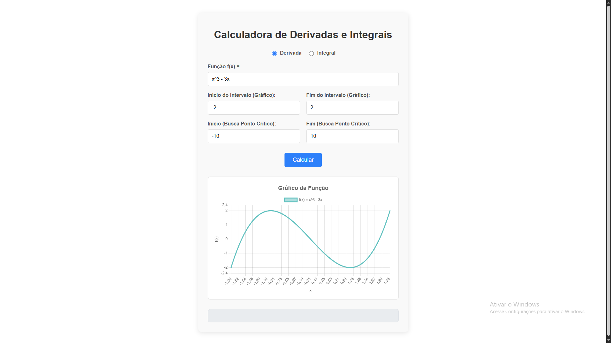

# 📊 Calculadora de Derivadas e Integrais


Uma aplicação web interativa e responsiva para análise de funções matemáticas, focada em cálculo diferencial e integral. Ideal para estudantes, professores e entusiastas da matemática que desejam visualizar e compreender o comportamento de funções.

## 🚀 Acesso ao Projeto

**A calculadora está disponível online! Acesse em:**

**[https://devstrawberry.github.io/CalculadoraDerivadaIntegral/](https://devstrawberry.github.io/CalculadoraDerivadaIntegral/)**

### Visualização


*(Sugestão: tire uma boa captura de tela do seu projeto, salve como `screenshot.png` na pasta raiz e adicione aqui)*

---

## ✨ Funcionalidades

-   **Análise de Derivadas:**
    -   [x] Cálculo da primeira e segunda derivada de uma função polinomial.
    -   [x] Localização de pontos críticos (máximos, mínimos e de inflexão) em um intervalo definido.
    -   [x] Classificação dos pontos críticos encontrados.
-   **Análise de Integrais:**
    -   [x] Cálculo de integrais definidas através de métodos numéricos.
    -   [x] Implementação da Soma de Riemann (esquerda, direita e ponto médio).
    -   [x] Implementação da Regra dos Trapézios.
    -   [x] Implementação da Regra de Simpson.
-   **Visualização Gráfica:**
    -   [x] Geração de um gráfico interativo da função em um intervalo especificado.
    -   [x] Eixos dinâmicos que se ajustam aos valores da função para melhor visualização.
-   **Design Responsivo:**
    -   [x] Interface totalmente adaptável para uso em desktops, tablets e smartphones (vertical e horizontal).

---

## 🛠️ Tecnologias Utilizadas

Este projeto foi construído com tecnologias modernas do ecossistema JavaScript:

-   **Frontend:** [React](https://reactjs.org/)
-   **Gráficos:** [Chart.js](https://www.chartjs.org/) com a biblioteca [react-chartjs-2](https://react-chartjs-2.js.org/)
-   **Lógica Matemática:** [Math.js](https://mathjs.org/)
-   **Hospedagem:** [GitHub Pages](https://pages.github.com/)
-   **CI/CD (Deploy Automático):** [GitHub Actions](https://github.com/features/actions)

---

## 💻 Como Executar o Projeto Localmente

Para executar a calculadora no seu ambiente de desenvolvimento, siga os passos abaixo:

1.  **Clone o repositório:**
    ```bash
    git clone https://github.com/DevStrawberry/CalculadoraDerivadaIntegral.git
    ```

2.  **Navegue até a pasta do frontend:**
    ```bash
    cd CalculadoraDerivadaIntegral/frontend
    ```

3.  **Instale as dependências:**
    ```bash
    npm install
    ```

4.  **Inicie o servidor de desenvolvimento:**
    ```bash
    npm start
    ```

A aplicação será aberta automaticamente no seu navegador no endereço `http://localhost:3000`.

---

## 📂 Estrutura do Projeto

A estrutura de pastas principal está organizada da seguinte forma:

```text
CalculadoraDerivadaIntegral/
├── .github/
│   └── workflows/           # ⚙️ Configuração do deploy automático (GitHub Actions)
├── frontend/
│   ├── public/              # 🌐 Arquivos estáticos e index.html
│   ├── src/
│   │   ├── components/      # 🧩 Componentes React (Calculator, FunctionGraph)
│   │   ├── logic/           # 🧠 Lógica principal do cálculo (calculatorEngine)
│   │   ├── App.js           # 🏠 Componente principal da aplicação
│   │   └── index.js         # 🚀 Ponto de entrada do React
│   ├── package.json         # 📦 Dependências e scripts do frontend
├── README.md                # 📘 Este arquivo
└── screenshot.png           # 🖼️ Captura de tela do projeto

---

## 📄 Licença

Este projeto está sob a licença MIT. Veja o arquivo [LICENSE](LICENSE.md) para mais detalhes.

---

## 👨‍💻 Autor

Feito com ❤️ por **[DevStrawberry](https://github.com/DevStrawberry)**.